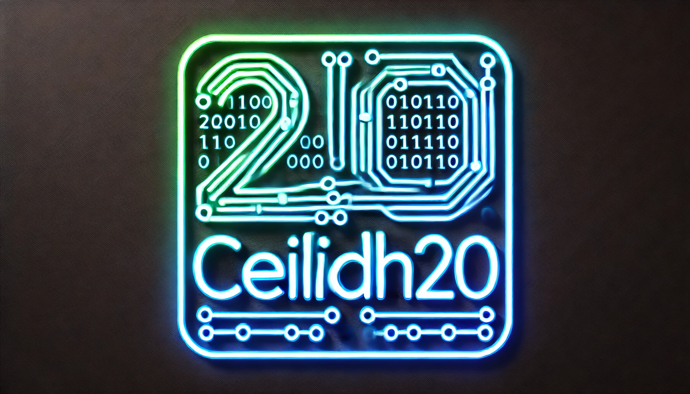

# Ceilidh20

Ceilidh20 /ˈkeɪ.li/, inspired by the traditional Scottish and Irish ceilidh dance, is a custom-implemented stream cipher designed for encryption and decryption, offering enhanced randomization for high-entropy, unpredictable ciphertext outputs. It supports legacy and modern JavaScript environments and is optimized for compatibility with `TypedArray` and `Buffer` types, enabling seamless integration into both browser and Node.js environments.

This implementation enhances traditional stream cipher designs, introducing a larger nonce, an additional initialization vector (IV) for randomization, and other advanced features for flexible cryptographic use cases.

---

## Key Features

+ **Randomized Output**: Generates different ciphertext outputs even for identical plaintext inputs.

+ **Forward and backward compatibility**: Ensures usability across various versions and systems.

+ **TypedArray and Buffer support**: Enhances interoperability with Node.js and browser environments.

+ **State variants**: Allows for customizable cryptographic states with the stateVariant parameter.

---

## How Ceilidh20 Cryptography Works?

### 1. Hash Pairing:

Generate a new initialization vector (IV) by hashing the user-provided IV and a randomly generated IV:

```
newIV = Sha256.Hash(generatedIV + userIV)
```

### 2. Encryption:

- Hash the combination of the user-provided IV and the generated IV to produce `newIV`.
- Encrypt the plaintext using the key, nonce, and the newly generated IV (`newIV`).
- Encrypt the generated IV with the same key and nonce for use in decryption.
- Concatenate both ciphertexts to form the final ciphertext:

```
newIV = Sha256.Hash(generatedIV + userIV)
c1 = encrypt(plaintext, key, nonce, newIV)
c2 = encrypt(generatedIV, key, nonce)
ciphertext = concat([c1, c2])
```

### 3. Decryption:

- Decrypt the second part of the ciphertext (`c2`) to retrieve the generated IV.
- Hash the user-provided IV combined with the decrypted generated IV to derive `newIV`.
- Decrypt the first part of the ciphertext (`c1`) using the derived `newIV` to recover the plaintext:

```
generatedIV = decrypt(c2, key, nonce)
newIV = Sha256.Hash(generatedIV + userIV)
plaintext = decrypt(c1, key, nonce, newIV)
```

---

## What is `genIVLen`?

The `genIVLen` parameter controls the length of a generated IV pair, which is used to further randomize the encryption process. When you provide an IV for encryption, this value dictates the length of the IV that will be generated. This generated IV is then combined with the user's provided IV by hashing both via SHA-256 to form a new IV. This newly hashed IV is then used to XOR with the ciphertext, adding an extra layer of randomization and ensuring that even identical plaintext inputs will produce different ciphertext outputs.

The `genIVLen` value can be set to any positive integer. The length of the generated IV pair impacts the final length of the ciphertext. If the `genIVLen` is set to a larger value, the output ciphertext will be correspondingly larger, adding flexibility in controlling the output size.

- The `genIVLen` value influences the length of the generated IV, which is crucial in determining the final ciphertext length.
- Larger `genIVLen` values create longer ciphertexts, contributing to higher randomness.
- The user-provided IV and the generated IV are hashed using SHA-256 to create a new IV, which is then XORed with the ciphertext, ensuring non-deterministic encryption results.

---

### What is `stateVariant`?

The `stateVariant` is an optional parameter that can adjust the internal cryptographic state of the cipher. While it can provide flexibility, using it incorrectly might compromise the cipher’s security. **It’s best to avoid using this parameter unless you fully understand how it affects the system**.

---

## Supported Environments

**Node.js**: Fully compatible.

**Browsers**: Compatible with most modern web browsers.

**Legacy versions**: It hasn’t been tested widely in older systems, though it has been tested in simulated environments.

---

# Installation

## Terminal Installation (for local setups):

You can clone the repository to your local machine using the following commands:

```bash
# root
sudo apt update && sudo apt upgrade -y
sudo git clone https://github.com/Harbinger-3/Ceilidh20
cd Ceilidh20

# non-root
apt update && apt upgrade -y
git clone https://github.com/Harbinger-3/Ceilidh20
cd Ceilidh20
```

## HTML Installation (for browser usage):

To use the cryptography in a browser, you can simply include the following script tag in your HTML:

```html
<script src="https://cdn.jsdelivr.net/gh/Harbinger-3/Ceilidh20/src/ceilidh20.js"></script>
```

*Note: It looks like `ceilidh20.min.js` didn’t update properly from [cdn.jsdelivr.net](https://cdn.jsdelivr.net/gh/Harbinger-3/Ceilidh20/src/ceilidh20.min.js). Please use the script tag provided above instead.*

---

## Basic Usage

The `Ceilidh20` function is the core of this implementation. The function encrypts or decrypts data based on the provided parameters:

### Function Signature:

```javascript
Ceilidh20(message, {
    key: key,
    iv: iv,
    nonce: nonce,
    genIVLen: genIVLen,
    stateVariant: array,
    isEncrypt: boolean
});
```

### Parameters:

- **`key`**: 32-byte (256-bit) encryption key.
- **`nonce`**: 24-byte (192-bit) nonce, unique for each encryption.
- **`iv`**: Initialization vector, any length.
- **`genIVLen`**: Length (number) of a generated IV pair, will affect the length of ciphertext.
- **`stateVariant`**: An optional array of four integers to customize the cipher’s internal state.
- **`isEncrypt`**: Boolean flag, `true` for encryption, `false` for decryption.

---

## Encryption Usage

To **encrypt** data using **Ceilidh20**, pass `isEncrypt: true`.
To **decrypt** data, pass `isEncrypt: false` and use the same **key**, **iv**, **nonce**, and **genIVLen** used during encryption.

### Encryption & Decryption Sample:

```html
<!DOCTYPE html>
<html lang="en">
<head>
   <meta charset="UTF-8">
   <meta name="viewport" content="width=device-width, initial-scale=1.0">
   <title>Ceilidh20 Encryption & Decryption</title>
   <script src="https://cdn.jsdelivr.net/gh/Harbinger-3/Ceilidh20/src/ceilidh20.js"></script>
</head>
<body>

<h1>Ceilidh20 Encryption & Decryption Example</h1>

<!-- Input textarea for the user -->
<h2>Enter Text to Encrypt:</h2>
<textarea id="inputText" rows="4" cols="50"></textarea><br><br>

<!-- Input for custom generate IV pair length -->
<h2>Length of Generated IV Pair:</h2>
<input type="number" id="ivPairLengthInput" placeholder="Leave blank for random IV pair length"><br><br>

<!-- Button to trigger encryption and decryption -->
<button onclick="processEncryptionDecryption()">Encrypt and Decrypt</button>

<!-- Containers to display results on the page -->
<h2>Original Data</h2>
<p id="originalData"></p>

<h2>Encrypted Data</h2>
<p id="encryptedData"></p>

<h2>Decrypted Data</h2>
<p id="decryptedData"></p>

<h2>Is Decryption Success?</h2>
<p id="isSuccess"></p>

<script>
// Function to handle encryption and decryption when the button is clicked
function processEncryptionDecryption() {
   // Retrieve the plaintext input from the textarea
   const plaintext = document.getElementById("inputText").value;

   // Generate random 32-byte key, 32-byte IV, and 24-byte nonce
   const key = new Uint8Array(32);
   const iv = new Uint8Array(32);
   const nonce = new Uint8Array(24);

   crypto.getRandomValues(key);    // Fill the key with random bytes
   crypto.getRandomValues(iv);     // Fill the IV with random bytes
   crypto.getRandomValues(nonce);  // Fill the nonce with random bytes

    // Parse or generate IV pair length value
    const genIVLenInput = Number(document.getElementById("ivPairLengthInput").value);
    const genIVLen = genIVLenInput
        ? Math.floor(genIVLenInput) 
        : 32;

    document.getElementById("isSuccess").textContent = ` Length of Generated IV Pair: ${genIVLen}`;

   // Display the original plaintext on the page
   document.getElementById("originalData").textContent = plaintext;

   // Encrypt the plaintext using Ceilidh20
   const encryptedData = Ceilidh20(plaintext, {
       key: key,            // 32-byte key
       iv: iv,              // 32-byte initialization vector
       nonce: nonce,        // 24-byte nonce
       genIVLen: genIVLen,  // Length of Generated IV Pair
       isEncrypt: true      // Encrypt the plaintext
   });

   // Convert the encrypted data to a readable string (if needed)
   const encryptedString = String.fromCharCode.apply(null, encryptedData);

   // Display the encrypted data on the page
   document.getElementById("encryptedData").textContent = encryptedString;

   // Decrypt the ciphertext using the same key, iv, and nonce
   const decryptedData = Ceilidh20(encryptedData, {
       key: key,            // Same 32-byte key used for encryption
       iv: iv,              // Same 32-byte initialization vector used for encryption
       nonce: nonce,        // Same 24-byte nonce used for encryption
       genIVLen: genIVLen,  // Length of Generated IV Pair
       isEncrypt: false     // Decrypt the ciphertext
   });

   // Convert the decrypted data back to a string
   const decryptedString = String.fromCharCode.apply(null, decryptedData);

   // Display the decrypted data on the page
   document.getElementById("decryptedData").textContent = decryptedString;

   // Check if decryption was successful by comparing decrypted data with the original plaintext
   const decryptionSuccess = decryptedString === plaintext;

   // Display the result of the decryption check
   document.getElementById("isSuccess").textContent += " Decryption success: " + (decryptionSuccess ? "Yes" : "No");
}
</script>

</body>
</html>
```

---

## Encryption with `stateVariant` (Optional)

You can modify the cryptographic state using the `stateVariant` parameter, which accepts an array of four integers. This is **optional**, and **not recommended** unless you understand its effects.

### Encryption & Decryption with `stateVariant`:

```html
<!DOCTYPE html>
<html lang="en">
<head>
    <meta charset="UTF-8">
    <meta name="viewport" content="width=device-width, initial-scale=1.0">
    <title>Ceilidh20 Custom State Variant</title>
    <script src="https://cdn.jsdelivr.net/gh/Harbinger-3/Ceilidh20/src/ceilidh20.js"></script>
</head>
<body>

<h1>Ceilidh20 Encryption & Decryption with Custom State Variant</h1>

<!-- Input textarea for the user -->
<h2>Enter Text to Encrypt:</h2>
<textarea id="inputText" rows="4" cols="50"></textarea><br><br>

<!-- Input for custom generate IV pair length -->
<h2>Length of Generated IV Pair:</h2>
<input type="number" id="ivPairLengthInput" placeholder="Leave blank for random IV pair length"><br><br>

<!-- Input for custom state array -->
<h2>Enter State Variant (comma separated values, e.g., 7,9,13,18):</h2>
<input type="text" id="stateArrayInput" placeholder="Enter state variant array"><br><br>

<!-- Button to trigger encryption and decryption -->
<button onclick="processEncryptionDecryption()">Encrypt and Decrypt</button>

<!-- Containers to display results on the page -->
<h2>Original Data</h2>
<p id="originalData"></p>

<h2>Encrypted Data</h2>
<p id="encryptedData"></p>

<h2>Decrypted Data</h2>
<p id="decryptedData"></p>

<h2>Is Decryption Success?</h2>
<p id="isSuccess"></p>

<script>
// Function to handle encryption and decryption when the button is clicked
function processEncryptionDecryption() {
    // Retrieve the plaintext input from the textarea
    const plaintext = document.getElementById("inputText").value;

    // Retrieve and parse the state array input
    const stateArrayInput = document.getElementById("stateArrayInput").value;
    const stateVariant = stateArrayInput.split(',').map(num => parseInt(num.trim())).filter(num => !isNaN(num));

    // Default state variant if no input is provided
    const defaultStateVariant = [7, 9, 13, 18];
    const finalStateVariant = stateVariant.length > 0 ? stateVariant : defaultStateVariant;

    // Display the original plaintext and selected state array on the page
    document.getElementById("originalData").textContent = `Plaintext: ${plaintext}`;
    document.getElementById("isSuccess").textContent = `Using state variant: ${finalStateVariant.join(', ')}`;

    // Generate random 32-byte key, 32-byte IV, and 24-byte nonce
    const key = new Uint8Array(32);
    const iv = new Uint8Array(32);
    const nonce = new Uint8Array(24);

    // Parse or generate IV pair length value
    const genIVLenInput = Number(document.getElementById("ivPairLengthInput").value);
    const genIVLen = genIVLenInput
        ? Math.floor(genIVLenInput) 
        : 32;

    document.getElementById("isSuccess").textContent += ` Length of Generated IV Pair: ${genIVLen}`;

    crypto.getRandomValues(key);    // Fill the key with random bytes
    crypto.getRandomValues(iv);     // Fill the IV with random bytes
    crypto.getRandomValues(nonce);  // Fill the nonce with random bytes

    // Encrypt the plaintext using Ceilidh20 with custom state variant
    const encryptedDataWithState = Ceilidh20(plaintext, {
        key: key,                      // 32-byte key
        iv: iv,                        // 32-byte initialization vector
        nonce: nonce,                  // 24-byte nonce
        genIVLen: genIVLen,           // Length of Generated IV Pair
        stateVariant: finalStateVariant,    // Custom state variant
        isEncrypt: true                // Flag to indicate encryption mode
    });

    // Convert the encrypted data to a readable string (if needed)
    const encryptedString = String.fromCharCode.apply(null, encryptedDataWithState);

    // Display the encrypted data on the page
    document.getElementById("encryptedData").textContent = `Encrypted: ${encryptedString}`;

    // Decrypt the ciphertext using the same key, iv, and nonce
    const decryptedDataWithState = Ceilidh20(encryptedDataWithState, {
        key: key,                      // Same 32-byte key
        iv: iv,                        // Same initialization vector
        nonce: nonce,                  // Same 24-byte nonce
        genIVLen: genIVLen,            // Length of Generated IV Pair
        stateVariant: finalStateVariant,    // Custom state variant
        isEncrypt: false               // Flag to indicate decryption mode
    });

    // Convert the decrypted data back to a string
    const decryptedString = String.fromCharCode.apply(null, decryptedDataWithState);

    // Display the decrypted data on the page
    document.getElementById("decryptedData").textContent = `Decrypted: ${decryptedString}`;

    // Check if the decryption is successful
    const isDecryptionSuccessful = (plaintext === decryptedString);
    document.getElementById("isSuccess").textContent += ` Decryption Success: ${isDecryptionSuccessful}`;
}
</script>

</body>
</html>
```

---

## Notes:

- **Randomized Output**: Due to the nonce and IV, the ciphertext will differ each time, even with identical plaintext inputs.
- **Security Warning**: Ensure the key, IV, nonce, and generated IV length are kept secure and unique for each encryption. Without it, decryption wouldn't be possible.
- **`stateVariant`**: Should be used carefully. The default `[7, 12, 8, 16]` is suitable for most use cases.

---

## Example: File Encryption & Decryption with Node.js

```javascript
const fs = require('fs');
const crypto = require('crypto');
const { Mash, Alea, Sha256, toBytes, toChars, uintArray, arraySlice, hexToBytes, get32, rotl, Ceilidh20_main, Ceilidh20 } = require('./src/ceilidh20');

// Generate random key, IV, and nonce
const key = crypto.randomBytes(32); // 32 bytes key
const iv = crypto.randomBytes(32);  // 32 bytes IV
const nonce = crypto.randomBytes(24); // 24 bytes nonce
const genIVLen = 32;

// Display the key, IV, and nonce
console.log("Key:", key.toString('hex'));
console.log("IV:", iv.toString('hex'));
console.log("Nonce:", nonce.toString('hex'));

// Read the file data
const fileData = fs.readFileSync("sample.png");

// Encrypt the data
console.time("Encryption Time");
const encryptedOutput = Ceilidh20(fileData, {
    key: key,           // 32-byte key
    iv: iv,             // initialization vector
    nonce: nonce,       // 24-byte nonce
    genIVLen: genIVLen, // generated IV pair length
    isEncrypt: true     // Encrypt binary
});
console.timeEnd("Encryption Time");

// Write encrypted file
fs.writeFileSync("sample.png.encrypted", encryptedOutput);

// Read encrypted file data
const encryptedFileData = fs.readFileSync("sample.png.encrypted");

// Decrypt the data
console.time("Decryption Time");
const decryptedOutput = Ceilidh20(encryptedFileData, {
    key: key,           // 32-byte key
    iv: iv,             // initialization vector
    nonce: nonce,       // 24-byte nonce
    genIVLen: genIVLen, // generated IV pair length
    isEncrypt: false    // Decrypt binary
});
console.timeEnd("Decryption Time");

// Write decrypted file
fs.writeFileSync("sample.png.decrypted", decryptedOutput);
```

## Important Notes

- **Key Length**: Ensure the key is always 32 bytes for correct encryption/decryption.

- **IV and Nonce Sizes**: The IV should be defined, and the nonce should be 24 bytes.

- **Generated IV Length**: The value of generated IV pair length must be the same for correct encryption/decryption.

- **State Variants**: The algorithm's behavior may change depending on the stateVariant; it is not recommended to use it.


## Note on `stateVariant`

This parameter allows you to modify the internal cryptographic state. It can be useful for certain advanced configurations, but it **should not be used unless you fully understand its effects on the encryption process**. The default `[7, 12, 8, 16]` state variant is recommended for most use cases.


---

# WARNING ⚠️

This cryptographic system is **"custom-implemented** and has not been widely reviewed by the cryptographic community. It was initially developed out of boredom and later became an open-source project.

<h3>Do not use this cipher for sensitive data or in production environments!</h3>

While inspired by **ChaCha20** and/or **Salsa20**, the system was modified to address certain weaknesses in stream ciphers, such as *deterministic outputs* that could be vulnerable to attacks like known-plaintext attacks. The modifications include a **larger nonce**, the introduction of an **IV**, and **hashing the IV pair** for added **randomization**, ensuring non-deterministic ciphertext output and, possibly, more security.

It is unclear whether this is a completely new cipher or merely a variant derived from existing stream cipher families.

# Open-source

**Ceilidh20** is an open-source project released under the [MIT License](./LICENSE.txt). It is available on GitHub for anyone to contribute or use.

We welcome contributions, but please review the **Warning** section before using this cipher in production systems.

# Donations

If you find this project useful or want to support its continued development, please consider **donating**.
Your contributions will help improve and maintain the project, as well as fund future enhancements.

<p align="center">
<a href="https://github.com/Harbinger-3/donate.md/blob/main/donation/donate.md" alt="Donate shield"></a>
</p>

Your support is greatly appreciated and helps keep the project alive! 🫶🏻🫶🏻🫶🏻

# License

This project is licensed under the MIT License - see the [LICENSE](./LICENSE.txt) file for details.
