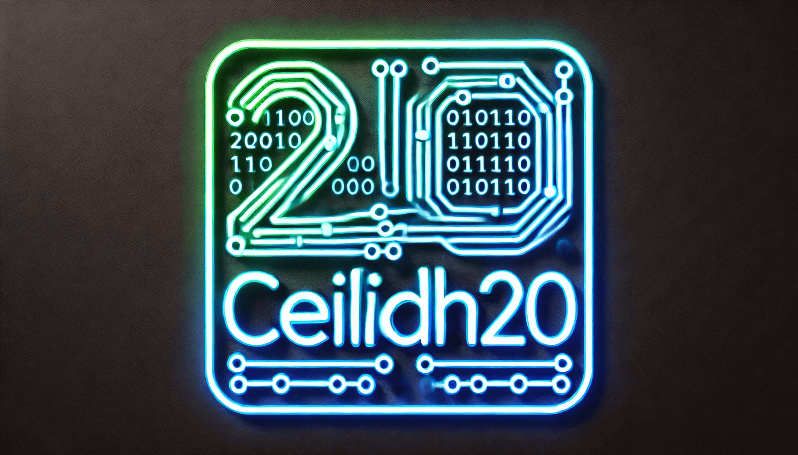

# Ceilidh20

Ceilidh20, inspired by the traditional Scottish and Irish ceilidh dance, is a custom-implemented stream cipher designed for encryption and decryption, offering enhanced randomization for high-entropy, unpredictable ciphertext outputs. It supports legacy and modern JavaScript environments and is optimized for compatibility with `TypedArray` and `Buffer` types, enabling seamless integration into both browser and Node.js environments.

This implementation enhances traditional stream cipher designs, introducing a larger nonce, an additional initialization vector (IV) for randomization, and other advanced features for flexible cryptographic use cases.

---

## Key Features

+ **Randomized Output**: Generates different ciphertext outputs even for identical plaintext inputs.

+ **Forward and backward compatibility**: Ensures usability across various versions and systems.

+ **TypedArray and Buffer support**: Enhances interoperability with Node.js and browser environments.

+ **State variants**: Allows for customizable cryptographic states with the stateVariant parameter.

---

## What is a `stateVariant`?

The `stateVariant` is an optional parameter that allows you to modify the internal cryptographic state of the cipher. It is an array of four integers that adjusts certain internal operations of the algorithm, potentially altering its behavior and the resulting encryption/decryption process, making it flexible but **it is not recommended to use**.

---

## Supported Environments

**Node.js**: Fully compatible.

**Browsers**: Compatible with most modern web browsers.

**Legacy versions**: It hasn’t been tested widely in older systems, though it has been tested in simulated environments.

---

# Installation

## Terminal Installation (for local setups):

You can clone the repository to your local machine using the following commands:

```bash
# root
sudo apt update && sudo apt upgrade -y
sudo git clone https://github.com/Harbinger-3/Ceilidh20
cd Ceilidh20

# non-root
apt update && apt upgrade -y
git clone https://github.com/Harbinger-3/Ceilidh20
cd Ceilidh20
```

## HTML Installation (for browser usage):

To use the cipher in a browser, you can simply include the following script tag in your HTML:

```html
<script src="https://cdn.jsdelivr.net/gh/Harbinger-3/Ceilidh20/src/ceilidh20.min.js"></script>
```

---

## Basic Usage

The `Ceilidh20` function is the core of this implementation. The function encrypts or decrypts data based on the provided parameters:

### Function Signature:

```javascript
Ceilidh20(message, {
    key: key,
    iv: iv,
    nonce: nonce,
    stateVariant: array,
    isEncrypt: boolean
});
```

### Parameters:

- **key**: 32-byte (256-bit) encryption key.
- **iv**: 32-byte initialization vector.
- **nonce**: 24-byte nonce, unique for each encryption.
- **stateVariant**: an optional array of four integers to customize the cipher’s internal state
- **isEncrypt**: Boolean flag, `true` for encryption, `false` for decryption.

---

## Encryption Usage

To **encrypt** data using **Ceilidh20**, pass `isEncrypt: true`.
To **decrypt** data, pass `isEncrypt: false` and use the same **key**, **iv**, and **nonce** used during encryption.

### Encryption & Decryption Sample:

```html
<!DOCTYPE html>
<html lang="en">
<head>
    <meta charset="UTF-8">
    <meta name="viewport" content="width=device-width, initial-scale=1.0">
    <title>Ceilidh20 Encryption & Decryption</title>
    <script src="https://cdn.jsdelivr.net/gh/Harbinger-3/Ceilidh20/src/ceilidh20.min.js"></script>
</head>
<body>

<h1>Ceilidh20 Encryption & Decryption Example</h1>

<!-- Input textarea for the user -->
<h2>Enter Text to Encrypt:</h2>
<textarea id="inputText" rows="4" cols="50"></textarea><br><br>

<!-- Button to trigger encryption and decryption -->
<button onclick="processEncryptionDecryption()">Encrypt and Decrypt</button>

<!-- Containers to display results on the page -->
<h2>Original Data</h2>
<p id="originalData"></p>

<h2>Encrypted Data</h2>
<p id="encryptedData"></p>

<h2>Decrypted Data</h2>
<p id="decryptedData"></p>

<h2>Is Decryption Success?</h2>
<p id="isSuccess"></p>

<script>
// Function to handle encryption and decryption when the button is clicked
function processEncryptionDecryption() {
    // Retrieve the plaintext input from the textarea
    const plaintext = document.getElementById("inputText").value;

    // Generate random 32-byte key, 32-byte IV, and 24-byte nonce
    const key = new Uint8Array(32);
    const iv = new Uint8Array(32);
    const nonce = new Uint8Array(24);

    crypto.getRandomValues(key);    // Fill the key with random bytes
    crypto.getRandomValues(iv);     // Fill the IV with random bytes
    crypto.getRandomValues(nonce);  // Fill the nonce with random bytes

    // Display the original plaintext on the page
    document.getElementById("originalData").textContent = plaintext;

    // Encrypt the plaintext using Ceilidh20
    const encryptedData = Ceilidh20(plaintext, {
        key: key,         // 32-byte key
        iv: iv,           // 32-byte initialization vector
        nonce: nonce,     // 24-byte nonce
        isEncrypt: true   // Encrypt the plaintext
    });

    // Convert the encrypted data to a readable string (if needed)
    const encryptedString = String.fromCharCode.apply(null, encryptedData);

    // Display the encrypted data on the page
    document.getElementById("encryptedData").textContent = encryptedString;

    // Decrypt the ciphertext using the same key, iv, and nonce
    const decryptedData = Ceilidh20(encryptedData, {
        key: key,         // Same 32-byte key used for encryption
        iv: iv,           // Same 32-byte initialization vector used for encryption
        nonce: nonce,     // Same 24-byte nonce used for encryption
        isEncrypt: false  // Decrypt the ciphertext
    });

    // Convert the decrypted data back to a string
    const decryptedString = String.fromCharCode.apply(null, decryptedData);

    // Display the decrypted data on the page
    document.getElementById("decryptedData").textContent = decryptedString;

    // Check if decryption was successful by comparing decrypted data with the original plaintext
    const decryptionSuccess = decryptedString === plaintext;

    // Display the result of the decryption check
    document.getElementById("isSuccess").textContent = decryptionSuccess ? "Yes" : "No";
}
</script>

</body>
</html>
```

---

## Encryption with `stateVariant` (Optional)

You can modify the cryptographic state using the `stateVariant` parameter, which accepts an array of four integers. This is **optional**, and **not recommended** unless you understand its effects.

### Encryption & Decryption with `stateVariant`:

```html
<!DOCTYPE html>
<html lang="en">
<head>
    <meta charset="UTF-8">
    <meta name="viewport" content="width=device-width, initial-scale=1.0">
    <title>Ceilidh20 Custom State Variant</title>
    <script src="https://cdn.jsdelivr.net/gh/Harbinger-3/Ceilidh20/src/ceilidh20.min.js"></script>
</head>
<body>

<h1>Ceilidh20 Encryption & Decryption with Custom State Variant</h1>

<!-- Input textarea for the user -->
<h2>Enter Text to Encrypt:</h2>
<textarea id="inputText" rows="4" cols="50"></textarea><br><br>

<!-- Input for custom state array -->
<h2>Enter State Variant (comma separated values, e.g., 7,9,13,18):</h2>
<input type="text" id="stateArrayInput" placeholder="Enter state variant array"><br><br>

<!-- Button to trigger encryption and decryption -->
<button onclick="processEncryptionDecryption()">Encrypt and Decrypt</button>

<!-- Containers to display results on the page -->
<h2>Original Data</h2>
<p id="originalData"></p>

<h2>Encrypted Data</h2>
<p id="encryptedData"></p>

<h2>Decrypted Data</h2>
<p id="decryptedData"></p>

<h2>Is Decryption Success?</h2>
<p id="isSuccess"></p>

<script>
// Function to handle encryption and decryption when the button is clicked
function processEncryptionDecryption() {
    // Retrieve the plaintext input from the textarea
    const plaintext = document.getElementById("inputText").value;

    // Retrieve and parse the state array input
    const stateArrayInput = document.getElementById("stateArrayInput").value;
    const stateVariant = stateArrayInput.split(',').map(num => parseInt(num.trim())).filter(num => !isNaN(num));

    // Default state variant if no input is provided
    const defaultStateVariant = [7, 9, 13, 18];
    const finalStateVariant = stateVariant.length > 0 ? stateVariant : defaultStateVariant;

    // Display the original plaintext and selected state array on the page
    document.getElementById("originalData").textContent = `Plaintext: ${plaintext}`;
    document.getElementById("isSuccess").textContent = `Using state variant: ${finalStateVariant.join(', ')}`;

    // Generate random 32-byte key, 32-byte IV, and 24-byte nonce
    const key = new Uint8Array(32);
    const iv = new Uint8Array(32);
    const nonce = new Uint8Array(24);

    crypto.getRandomValues(key);    // Fill the key with random bytes
    crypto.getRandomValues(iv);     // Fill the IV with random bytes
    crypto.getRandomValues(nonce);  // Fill the nonce with random bytes

    // Encrypt the plaintext using Ceilidh20 with custom state variant
    const encryptedDataWithState = Ceilidh20(plaintext, {
        key: key,                      // 32-byte key
        iv: iv,                        // 32-byte initialization vector
        nonce: nonce,                  // 24-byte nonce
        stateVariant: finalStateVariant,    // Custom state variant
        isEncrypt: true                // Flag to indicate encryption mode
    });

    // Convert the encrypted data to a readable string (if needed)
    const encryptedString = String.fromCharCode.apply(null, encryptedDataWithState);

    // Display the encrypted data on the page
    document.getElementById("encryptedData").textContent = `Encrypted: ${encryptedString}`;

    // Decrypt the ciphertext using the same key, iv, and nonce
    const decryptedDataWithState = Ceilidh20(encryptedDataWithState, {
        key: key,                      // Same 32-byte key
        iv: iv,                        // Same 32-byte initialization vector
        nonce: nonce,                  // Same 24-byte nonce
        stateVariant: finalStateVariant,    // Custom state variant
        isEncrypt: false               // Flag to indicate decryption mode
    });

    // Convert the decrypted data back to a string
    const decryptedString = String.fromCharCode.apply(null, decryptedDataWithState);

    // Display the decrypted data on the page
    document.getElementById("decryptedData").textContent = `Decrypted: ${decryptedString}`;

    // Check if the decryption is successful
    const isDecryptionSuccessful = (plaintext === decryptedString);
    document.getElementById("isSuccess").textContent += ` Decryption Success: ${isDecryptionSuccessful}`;
}
</script>

</body>
</html>
```

---

## Notes:

- **Randomized Output**: Due to the nonce and IV, the ciphertext will differ each time, even with identical plaintext inputs.
- **Security Warning**: Ensure the key, IV, and nonce are kept secure and unique for each encryption.
- **`stateVariant`**: Should be used carefully. The default `[7, 12, 8, 16]` is suitable for most use cases.

---

## Example: File Encryption with Node.js

### Encryption Example:

```javascript
const fs = require('fs');
const crypto = require('crypto');
const { Mash, Alea, toBytes, uintArray, arraySlice, get32, rotl, Ceilidh20_main, Ceilidh20 } = require('./src/ceilidh20');

const key = crypto.randomBytes(32); // 32 bytes key
const iv = crypto.randomBytes(32);  // 32 bytes IV
const nonce = crypto.randomBytes(24); // 24 bytes nonce

const fileData = fs.readFileSync("sample.png");
const encryptedOutput = Ceilidh20(fileData, {
    key: key,         // 32-byte key
    iv: iv,           // 32-byte initialization vector
    nonce: nonce,     // 24-byte nonce
    isEncrypt: true   // Encrypt binary
});
fs.writeFileSync("sample.png.encrypted", encryptedOutput);
```

### Decryption Example:

```javascript
const fs = require('fs');
const crypto = require('crypto');
const { Mash, Alea, toBytes, uintArray, arraySlice, get32, rotl, Ceilidh20_main, Ceilidh20 } = require('./src/ceilidh20');

const key = Buffer.from([/* your 32-bytes key here */]);
const iv = Buffer.from([/* your 32-bytes iv here */]);
const nonce = Buffer.from([/* your 24-bytes nonce here */]);

const fileData = fs.readFileSync("sample.png.encrypted");
const decryptedOutput = Ceilidh20(fileData, {
    key: key,         // 32-byte key
    iv: iv,           // 32-byte initialization vector
    nonce: nonce,     // 24-byte nonce
    isEncrypt: false  // Decrypt binary
});
fs.writeFileSync("sample.png", decryptedOutput);
```

## Important Notes

- **Key Length**: Ensure the key is always 32 bytes for correct encryption/decryption.

- **IV and Nonce Sizes**: The IV should be 32 bytes, and the nonce should be 24 bytes.

- **State Variants**: The algorithm's behavior may change depending on the stateVariant; it is not recommended to use it.


## Note on `stateVariant`

This parameter allows you to modify the internal cryptographic state. It can be useful for certain advanced configurations, but it **should not be used unless you fully understand its effects on the encryption process**. The default `[7, 12, 8, 16]` state variant is recommended for most use cases.


---

# WARNING ⚠️

This cryptographic system is **custom-implemented** and has not been widely reviewed by the cryptographic community. It was initially developed <b>out of boredom</u>, and became an open-source project. <h3>Do not use this cipher for sensitive data or in production environments!</h3>

The design was based on **ChaCha20** and/or **Salsa20** and it was modified to address some of the challenges associated with stream ciphers, such as <u>deterministic outputs</u> which can have vulnerabilities like predictability and susceptibility to known-plaintext attacks, where an attacker can exploit the repetitive nature of the cipher to recover the secret key or plaintext.

Key differences include a **larger nonce**, the addition of an **IV** for **randomization**, and **non-deterministic ciphertext** output. It is uncertain whether this is a completely new cipher or simply a <u>variant</u> derived from existing stream cipher families.

# Open-source

**Ceilidh20** is an open-source project released under the [MIT License](./LICENSE.txt). It is available on GitHub for anyone to contribute or use.

We welcome contributions, but please review the **Warning** section before using this cipher in production systems.

# Donations

If you find this project useful or want to support its continued development, please consider **donating**.
Your contributions will help improve and maintain the project, as well as fund future enhancements.

<p align="center">
<a href="https://github.com/Harbinger-3/donate.md/blob/main/donation/donate.md" alt="Donate shield"></a>
</p>

Your support is greatly appreciated and helps keep the project alive! 🫶🏻🫶🏻🫶🏻

# License

This project is licensed under the MIT License - see the [LICENSE](./LICENSE.txt) file for details.
